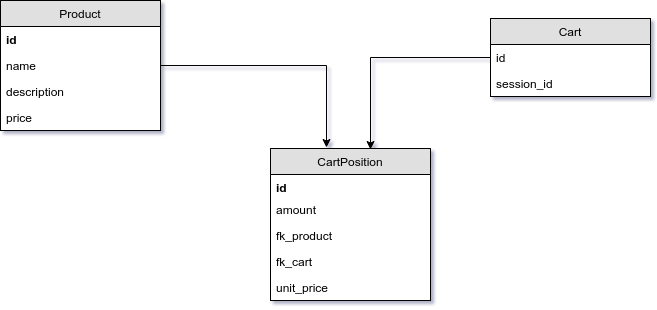

# Content

This directory contains an excercise task of building example web store api.

# Case

API sklepu internetowego, który obsługuje: produkty, ceny (ceny mogą się zmieniać w czasie), koszyk (listę produktów z cenami oraz ilością)

Dostępne funkcje:

* Pobierania listy produktów
* Przeszukiwanie listy produktów  po nazwie produktu
* Pobieranie danych produktu podając jego ID
* Tworzenie koszyka
* Dodawanie/Usuwanie produktów do koszyka
* Zmiana ilości produktów w koszyku
* Pobierania zawartości koszyka. 
 
Prosimy o zrobienie:

* Zaimplementowany model bazy danych w którejś z wbudowanych baz danych  (h2, hsql lub inna)
* Wprowadzone dane kilku produktów
* REST API z przykładami użycia w testach jednostkowych  
* Aplikacja powinna się uruchamiać z Mavena (można użyć Spring boot lub embedded  Jetty/Tomcat)

# Solution

I've used: 

* spring-boot - for convenience of embedded web server and annotation based configuration
* hibernate with h2 database - I've chosen annotation based configuration

for testing:
* junit
* mockito 
* assertJ

## Running the application

Application is based on spring-boot, according to that fact start application by:

    $ mvn spring-boot:run 

## Tests

I've categorized tests into:

* Fast Tests - junit tests during TDD development
* Slow Tests - integration tests with DB and Spring context enabled
* Functional tests for requested functionalities

For running tests:

    $ mvn test

## ER diagram for db

[draw.io link](https://www.draw.io/?lightbox=1&highlight=0000ff&edit=_blank&layers=1&nav=1&title=webstore-firstdata.xml#Uhttps%3A%2F%2Fraw.githubusercontent.com%2Fsratatata%2Fdojo%2Fweb_store_first_data%2F2017%2Fwebstore%2Fdocs-statics%2Fwebstore-firstdata.xml)

Products contains it's price. 
Cart has it's id which in this example is session_id, and one to many relation to product. 
Price is copied to the cart in case price could be changed, we would like to avoid changes in 
already realized orders or existing carts. 

In more realistic example, we could introduce PriceTag table which could contain prices with timestamps.
This could be used for reporting or for updating existing not realized carts. 

Another thing we could implement is orders table, which could contain already realized orders ("copies" from cart) and removing 
cart row after realization of order. 

For sake of simplicity I've not implementing ordering feature as not requested one. 

## Packages and architecture

I've focused on core based architecture. 

# Development process

Due to fact I need to remind my self some tech, 
I've created walking skeleton based on spring-boot hello world sample.
Than I've worked on preparing testing strategy and tools. 

When I was ready I've switched to TDD development.  